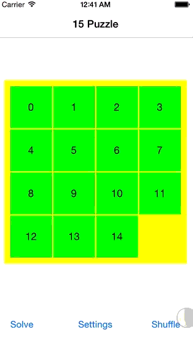

Fifteen Puzzle
==============

iOS Fifteen Puzzle using Apple's Swift language.

Demo
====

Getting Started
===============

1. Install [cocoapods](http://cocoapods.org).
2. Before opening the project from command line run `pod install`.
3. Open the .xcworkspace file.

To Do
=====
1. A* is not really working at the moment.
2. There are scattered TODO's within the code comments.
3. Change tile so that user can interact with it likely using UIDynamics.
4. Make the app universal (size, orientation).
5. Allow user to upload image to replace colors/numbered tiles.
6. When A* is perfected perhaps it can always run in background in case user requests the puzzle to be solved. This would also allow for the tiles to be lit up dynamically in the order the user should be moving them. Currently on the first tile in lights up.